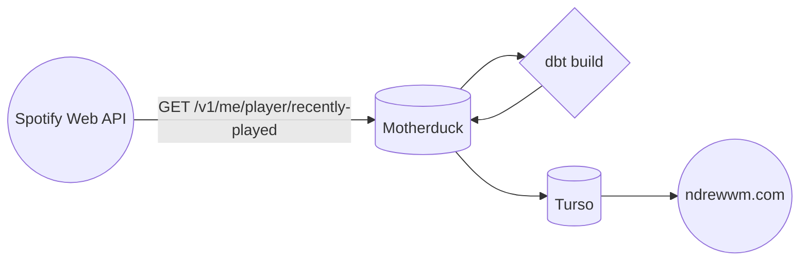

# spotify-tracks

This repo contains a [dbt-core](https://github.com/dbt-labs/dbt-core) project and [Prefect](https://docs.prefect.io/latest/) flows that are used to power some visualizations on my personal site. This project draws upon aspects of "the modern data stack", specifically the use of cloud-based computing and storage to complete its tasks:

- Prefect is used for scheduled orchestration. While various open-source tools are leveraged, Python (via Prefect) is being used to specify how they're invoked. Rather than spinning up a local server or container-based platform to run the flow, this project makes use of Prefect's [Managed Execution](https://docs.prefect.io/latest/guides/managed-execution/) offering. The flow is deployed via an execution of `flow.from_source().deploy()`, which tells Prefect Cloud where to find the code associated with the flow/deployment. When a flow run is started, Prefect handles the provisioning of a container environment where the code is actually run.

- Spotify's Web API is the source of data for the project; specifically the [`/me/player/recently-played` endpoint](https://developer.spotify.com/documentation/web-api/reference/get-recently-played). Developers wanting to make use of this endpoint will need to grant access to their application via the [Authorization Code Flow](https://developer.spotify.com/documentation/web-api/tutorials/code-flow), which involves a callback from Spotify's authentication service.

- Once the recently played tracks have been gathered, data is then stored in a [duckdb](https://duckdb.org/) database hosted by [Motherduck](https://motherduck.com/). I opted for duckdb/Motherduck based on the friendliness of duckdb's syntax, and its compatibility with `dbt-core`.

- After the project's data models have been built by dbt, the resulting tables are pushed to a [`turso` database](https://turso.tech/). Turso is built on an extension of `SQLite`, and happens to play a bit nicer with my website's web framework. Ideally, I'd be able to rely on a single storage provider for the project, but I was mostly unsuccessful at getting the snappiness/speed I was hoping for via Motherduck within my website itself.

